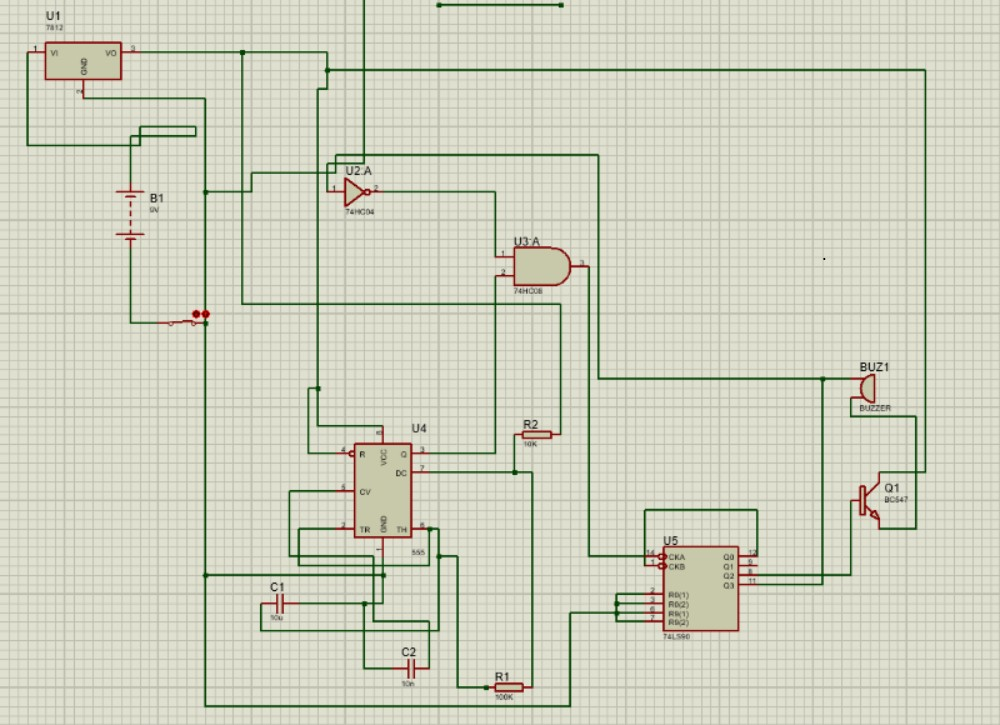
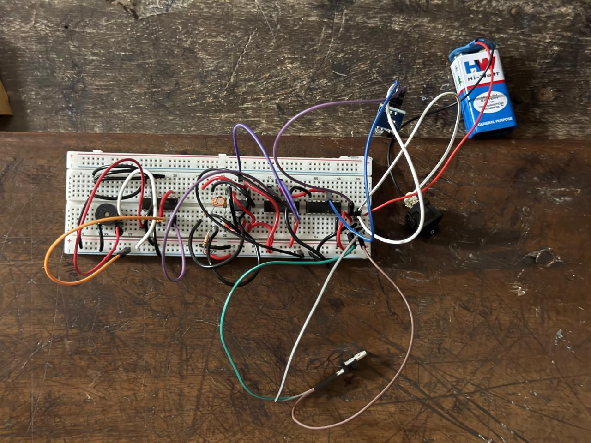

# Hardware-Based Drowsiness Detector

A real-time, hardware-only drowsiness detection system designed to detect prolonged eye closure and provide an audible warning. The system is implemented using basic analog and digital electronic components without a microcontroller or software.

## Overview

Drowsiness can reduce alertness, reaction time, and decision-making ability, creating safety risks in transportation and industrial environments.

This project uses an IR sensor to monitor eye activity. When prolonged eye closure is detected, the signal is processed using logic gates, a timer, and a counter. Once the preset duration is exceeded, a buzzer is activated to alert the user.

## Key Features

* Hardware-only implementation
* No microcontroller or programming required
* IR-based eye activity detection
* Logic-gate signal processing
* NE555 timer-based timing
* 74LS90 counter for duration tracking
* Audible buzzer alert
* Manual reset mechanism
* Low-cost and easily available components

## Working Principle

The system operates through the following stages:

1. **IR Sensor** — Monitors the user's eye activity using reflected infrared light.
2. **Signal Conditioning** — The sensor signal is converted into a suitable logic signal.
3. **NOT Gate (74HC04)** — Inverts the sensor signal for the required logic condition.
4. **AND Gate (74HC08)** — Processes the eye-closure and timing conditions.
5. **NE555 Timer** — Generates timing pulses.
6. **74LS90 Counter** — Counts the timing pulses while the eye remains closed.
7. **BC547 Transistor** — Drives the buzzer circuit.
8. **Buzzer** — Produces an audible warning when prolonged eye closure is detected.
9. **Manual Reset** — Resets the system for another detection cycle.

## Hardware Components

| Component         | Function                       |
| ----------------- | ------------------------------ |
| IR Sensor         | Detects eye activity           |
| 74HC04            | NOT gate                       |
| 74HC08            | AND gate                       |
| 74LS90            | Decade counter                 |
| NE555             | Timer / pulse generation       |
| BC547             | Buzzer driver                  |
| Buzzer            | Audible alert                  |
| Resistors         | Timing and signal conditioning |
| Capacitors        | Timing and filtering           |
| Voltage Regulator | Provides regulated supply      |
| 9V Battery        | Power source                   |

## Circuit Diagram

## Prototype

## Results

The prototype was tested with different eye-closure durations and lighting conditions. The IR sensor was positioned approximately 2–3 cm from the eye during testing.

The testing evaluated:

* Eye open/closed detection
* Prolonged eye-closure detection
* Counter operation
* Buzzer response
* Manual reset operation
* Operation under different lighting conditions

## Applications

* Driver safety systems
* Industrial safety
* Fatigue monitoring
* Educational digital electronics projects
* Hardware-based safety systems

## Advantages

* No programming required
* Low-cost components
* Real-time response
* Simple construction and maintenance
* Suitable for educational applications
* Can operate from a battery-powered supply

## Future Improvements

* Improved IR sensor calibration
* Better rejection of ambient-light interference
* Adaptive sensing for different users
* Wireless alerts
* Data logging
* Environmental compensation

## Documentation

* [Project Report](Report/Drowsiness_Detector_Report.pdf)
* [Project Presentation](Presentation/Drowsiness_Detector_Presentation.pdf)

## Project Type

**Course:** Logic Circuit Design
**Domain:** Digital Electronics / Hardware Systems
**Implementation:** Hardware-only
**Microcontroller:** None
**Software/Code:** None

## Team

* Akshaj CP
* Akshara K Murali
* Amit Krishna KM
* Amita A R
